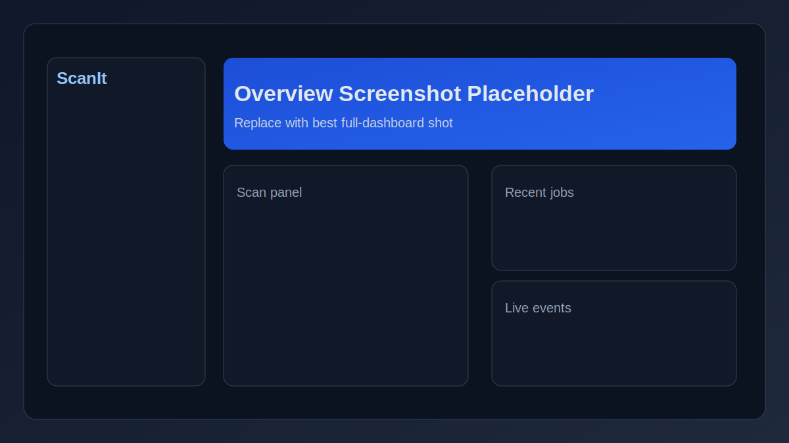
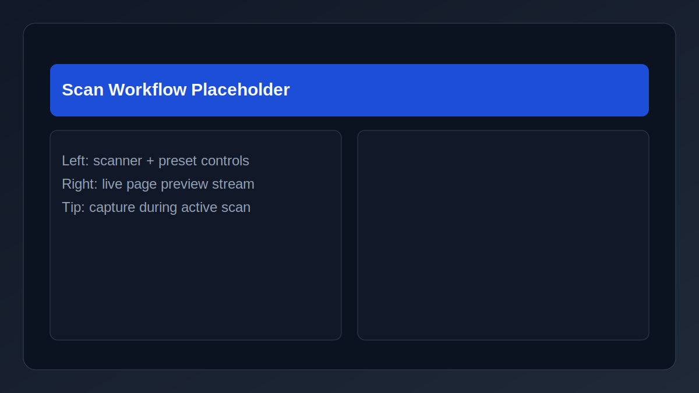
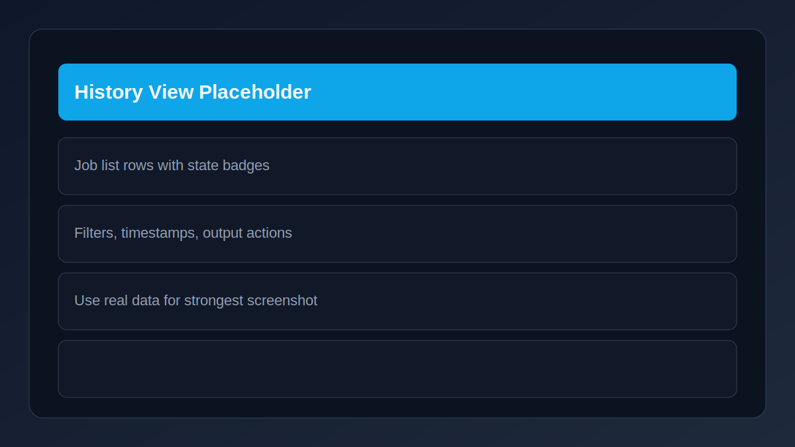
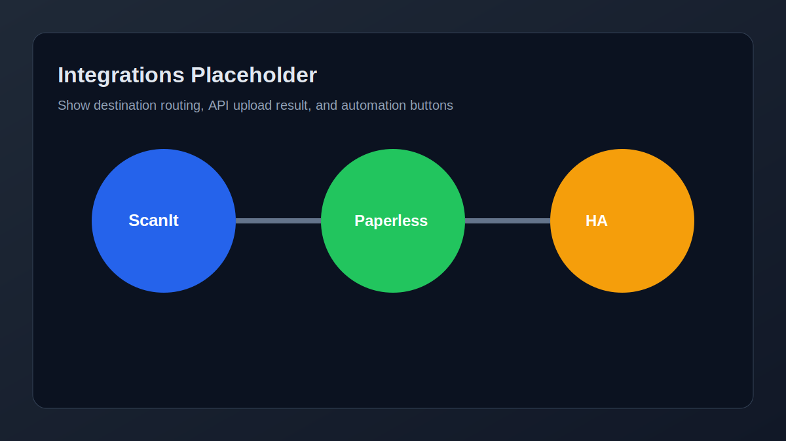

# ScanIt

<p>
  <a href="https://ghcr.io/mindcollaps/scanit"></a>
  
  
  
</p>

Config-driven web scanning platform that wraps SANE scanners behind a modern Vue 3 UI with real-time job tracking, workflows, and pluggable integrations (Paperless-ngx, Home Assistant, and more).

## ✨ Why ScanIt

- 🚀 Fast setup with a published Docker image: ghcr.io/mindcollaps/scanit:latest
- 🧠 Config-first behavior with live reload
- 📷 ADF + flatbed support with real-time page previews
- 🧩 Integrations for Paperless-ngx and Home Assistant
- 🐳 Works as a single container with host networking for scanner discovery

## 🧭 Quick Links

- [ScanIt](#scanit)
  - [✨ Why ScanIt](#-why-scanit)
  - [🧭 Quick Links](#-quick-links)
  - [🖼️ App Showcase](#️-app-showcase)
  - [⚡ Quick Start (Copy Compose and Run)](#-quick-start-copy-compose-and-run)
  - [📦 Deploy With docker run](#-deploy-with-docker-run)
  - [🖨️ First Scan In 2 Minutes](#️-first-scan-in-2-minutes)
  - [⚙️ Configuration](#️-configuration)
  - [🔌 Integrations](#-integrations)
    - [🏠 Home Assistant](#-home-assistant)
    - [📄 Paperless-ngx](#-paperless-ngx)
  - [🧱 Clone and Build Yourself](#-clone-and-build-yourself)
  - [🧪 Developer Commands](#-developer-commands)
  - [📡 API Snapshot](#-api-snapshot)
  - [📚 Documentation](#-documentation)
  - [🛠️ Tech Stack](#️-tech-stack)
  - [📄 License](#-license)

## 🖼️ App Showcase



| Scan Workflow | History |
|---|---|
|  |  |

| Integrations |
|---|
|  |

Suggested real captures:

- Main scan page during an active multi-page scan
- Job history with mixed statuses and actions visible
- Job detail page with page thumbnails and final PDF download
- Integrations/config page showing Paperless and Home Assistant setup

## ⚡ Quick Start (Copy Compose and Run)

Requirements:

- Linux host (required for network_mode: host)
- Docker + Docker Compose v2

1. Create a folder and move into it:

```sh
mkdir -p scanit && cd scanit
```

2. Create docker-compose.yml and paste this:

```yaml
services:
  scanit:
    image: ghcr.io/mindcollaps/scanit:latest
    restart: unless-stopped
    network_mode: host
    environment:
      SCANIT_CONFIG_DIR: /config
    volumes:
      - ./config:/config
      - ./.data/output:/data/output
      - ./.data/db:/data/db
      - sane_config:/etc/sane.d
      - /var/run/dbus:/var/run/dbus
      - /run/avahi-daemon/socket:/run/avahi-daemon/socket

volumes:
  sane_config:
```

3. Start it:

```sh
docker compose up -d
```

4. Open: http://localhost:8863

On first start, ScanIt automatically creates /config/00-system.yaml and /config/scanit.yaml for you.

## 📦 Deploy With docker run

If you prefer a plain docker command:

```sh
mkdir -p scanit/config scanit/.data/output scanit/.data/db && cd scanit
docker volume create scanit_sane_config
docker run -d --name scanit \
  --restart unless-stopped \
  --network host \
  -e SCANIT_CONFIG_DIR=/config \
  -v "$PWD/config:/config" \
  -v "$PWD/.data/output:/data/output" \
  -v "$PWD/.data/db:/data/db" \
  -v scanit_sane_config:/etc/sane.d \
  -v /var/run/dbus:/var/run/dbus \
  -v /run/avahi-daemon/socket:/run/avahi-daemon/socket \
  ghcr.io/mindcollaps/scanit:latest
```

Useful commands:

```sh
docker logs -f scanit
docker stop scanit
docker rm scanit
```

## 🖨️ First Scan In 2 Minutes

1. Open the Scan page.
2. Select scanner and preset.
3. Start scan and watch real-time progress.
4. Download PDF or route to your configured destination.

## ⚙️ Configuration

Config is loaded from /config and merged alphabetically.

| File | Purpose |
|---|---|
| 00-system.yaml | System defaults (keep as provided) |
| scanit.yaml | Your scanners, presets, workflows, integrations |

Tips:

- Changes hot-reload automatically.
- Use [examples/](examples/) for complete scenarios.
- Full schema: [docs/CONFIG_SCHEMA.md](docs/CONFIG_SCHEMA.md)

## 🔌 Integrations

ScanIt ships with two built-in integration paths for automation and document archiving.

### 🏠 Home Assistant

Home Assistant integration uses MQTT Discovery to create scan trigger buttons and status entities directly in HA.

- Best for one-tap scans from dashboards or mobile.
- Supports multiple scan buttons mapped to different presets.
- Works with mode cycling for held workflows (default, double_sided, endless).

Minimal structure in scanit.yaml:

```yaml
integrations:
  homeassistant:
    enabled: true
    mqtt:
      brokerUrl: "mqtt://localhost:1883"
      username: "${MQTT_USER}"
      password: "${MQTT_PASS}"
    discovery:
      prefix: "homeassistant"
      deviceName: "ScanIt"
      deviceId: "scanit"
    buttons:
      - id: "scan_quick"
        label: "Quick Scan"
        presetId: "doc_300_color"
```

Full example: [examples/scanit.homeassistant.yaml](examples/scanit.homeassistant.yaml)

### 📄 Paperless-ngx

Paperless integration uploads completed scans as PDF documents to one or more Paperless-ngx instances.

- Supports multiple named Paperless instances.
- Uses tokenEnv values so API tokens stay in environment variables.
- Consumer type format: paperless:id

Minimal structure in scanit.yaml:

```yaml
integrations:
  paperless:
    - id: shared
      label: "Shared Archive"
      baseUrl: "https://paperless.example.com"
      tokenEnv: "PAPERLESS_SHARED_TOKEN"
      timeoutMs: 30000
      verifyTls: true
```

Full example: [examples/scanit.paperless.yaml](examples/scanit.paperless.yaml)

## 🧱 Clone and Build Yourself

Use this mode when you want to modify source code or build your own image.

```sh
git clone https://github.com/MindCollaps/ScanIt.git
cd ScanIt
docker compose -f docker-compose.build.yml up --build -d
```

Repo compose files:

- [docker-compose.yml](docker-compose.yml): run the published GHCR image
- [docker-compose.build.yml](docker-compose.build.yml): build from local source
- [docker-compose.dev.yml](docker-compose.dev.yml): development stack with hot reload

## 🧪 Developer Commands

Configured scripts from package.json:

| Script | Description |
|---|---|
| bun run build | Build server and client |
| bun run build:server | Compile server TypeScript |
| bun run build:client | Build client with Vite |
| bun dev | Start development compose stack |
| bun run dev:inside | Run server and client concurrently |
| bun run dev:server | Watch server |
| bun run dev:client | Vite dev server on 0.0.0.0:5173 |
| bun run typecheck | Type-check server + client |
| bun run lint | ESLint + Stylelint |
| bun run lint:fix | Auto-fix linting issues |
| bun run format | Prettier write |
| bun run format:check | Prettier check |
| bun run ci | typecheck + lint + format:check |
| bun run start | Run dist/server/index.js |

## 📡 API Snapshot

<details>
<summary><strong>Health and Config</strong></summary>

- GET /healthz
- GET /readyz
- GET /api/config/status
- GET /api/config/runtime

</details>

<details>
<summary><strong>Scanners and Presets</strong></summary>

- GET /api/scanners
- POST /api/scanners/discover
- GET /api/scanners/discovered
- GET /api/scanners/discovered/:id/capabilities
- GET /api/scanners/diagnostics
- GET /api/presets
- GET /api/presets/user
- POST /api/presets
- PUT /api/presets/:id
- DELETE /api/presets/:id

</details>

<details>
<summary><strong>Jobs and History</strong></summary>

- POST /api/jobs
- GET /api/jobs/:id
- GET /api/jobs/:id/pages
- GET /api/jobs/:id/pages/:index
- GET /api/jobs/:id/pages/by-name/:filename
- GET /api/jobs/:id/pdf
- PUT /api/jobs/:id/filename
- POST /api/jobs/:id/append
- PUT /api/jobs/:id/pages/reorder
- POST /api/jobs/:id/pages/interleave
- DELETE /api/jobs/:id
- POST /api/jobs/batch-delete
- GET /api/history

</details>

<details>
<summary><strong>Realtime</strong></summary>

- GET /api/events

</details>

## 📚 Documentation

- [docs/ARCHITECTURE.md](docs/ARCHITECTURE.md) - architecture and module boundaries
- [docs/CONFIG_SCHEMA.md](docs/CONFIG_SCHEMA.md) - configuration reference
- [docs/PROJECT_PLAN.md](docs/PROJECT_PLAN.md) - implementation plan
- [docs/AI_GUIDE.md](docs/AI_GUIDE.md) - contributor guide for AI assistants

## 🛠️ Tech Stack

- Runtime: [Bun](https://bun.sh)
- Backend: Express 5, TypeScript, Zod v4, pino
- Frontend: Vue 3 (Composition API), Vite 7, vue-router
- Database: bun:sqlite
- Scanner: SANE (scanimage and scanadf)
- Container: Docker

## 📄 License

ISC
